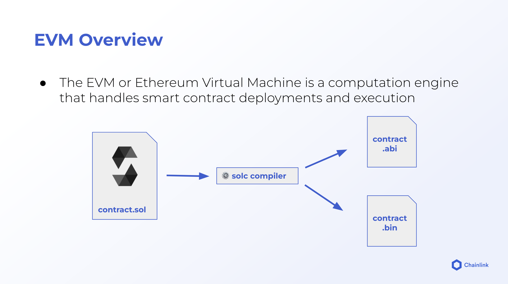
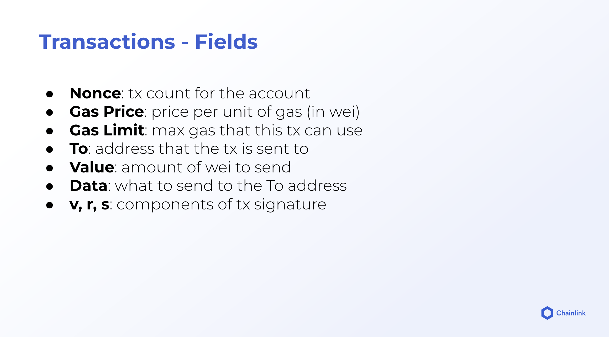
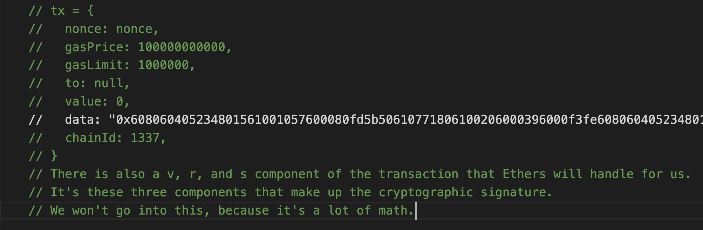
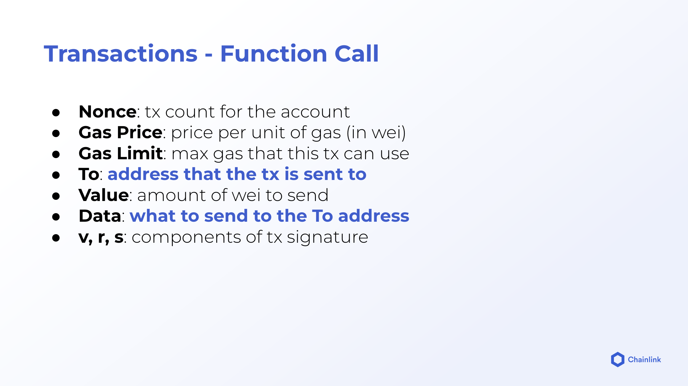
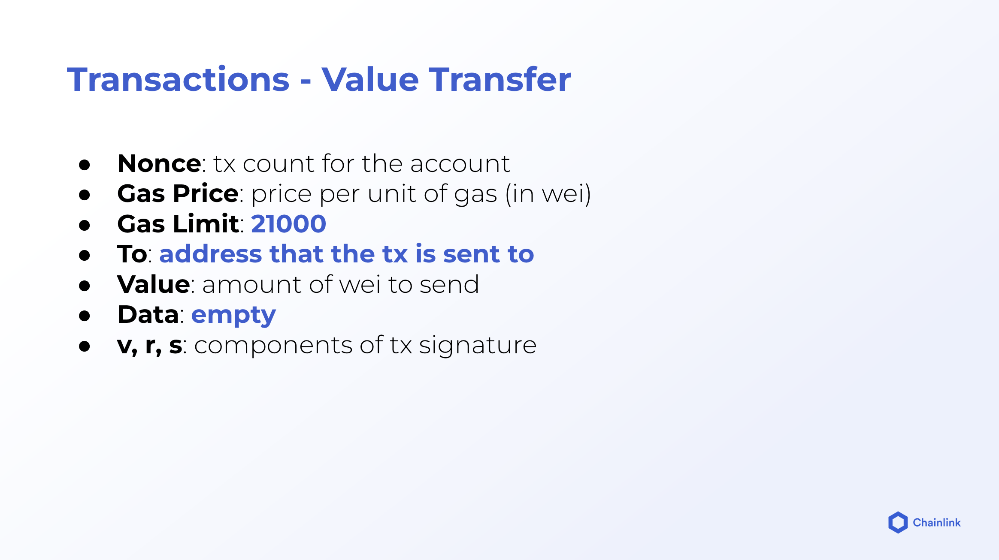
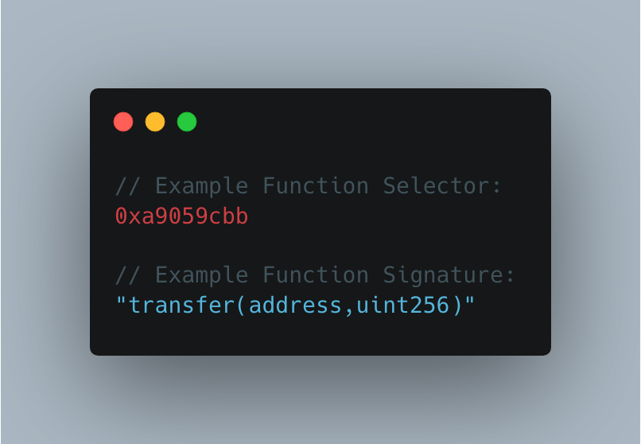

# Advanced Solidity: Some Low Level Stuff

## QuickStart

Clone this repo

```
git clone https://github.com/0xSanyam/advanced-solidity
```

```
yarn
```

```
yarn compile
```

**OR**

Copy the contracts to [remix](https://remix-project.org/) and deploy them simply!

## Some images for understanding












